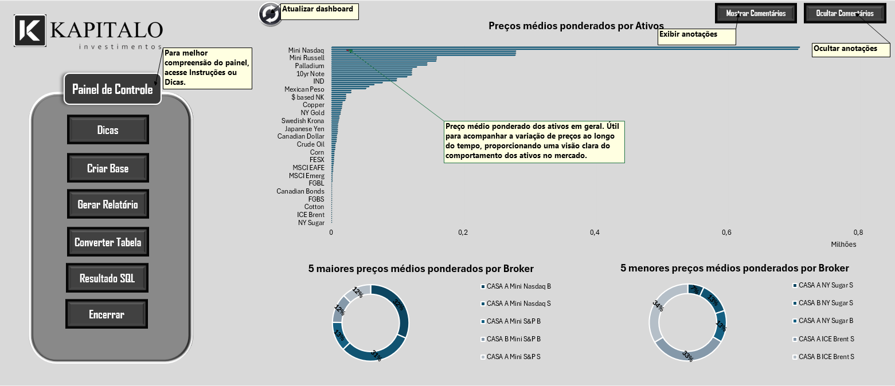

# Análise de Dados com VBA

Este projeto integra diversas ferramentas e linguagens de programação para solucionar problemas complexos em análise e gestão de dados. As soluções foram implementadas em VBA, acompanhadas de cálculos e consultas SQL para atender aos requisitos gerenciais e analíticos.

### Resumo do Projeto

O projeto inclui a criação de planilhas interativas para gestão de bases de dados, com funcionalidades de importação e exportação, cálculos gerenciais, integração entre SQL e VBA, além de relatórios automáticos e detalhados sobre os ativos para análise. No **[Fluxo](Fluxo.pdf)**, o usuário pode visualizar o caminho e as funções principais, tanto no início quanto no final do projeto. Além disso, o arquivo xlsm pode ser baixado **[Sumario.xlsm](Sumario.xlsm)**.
