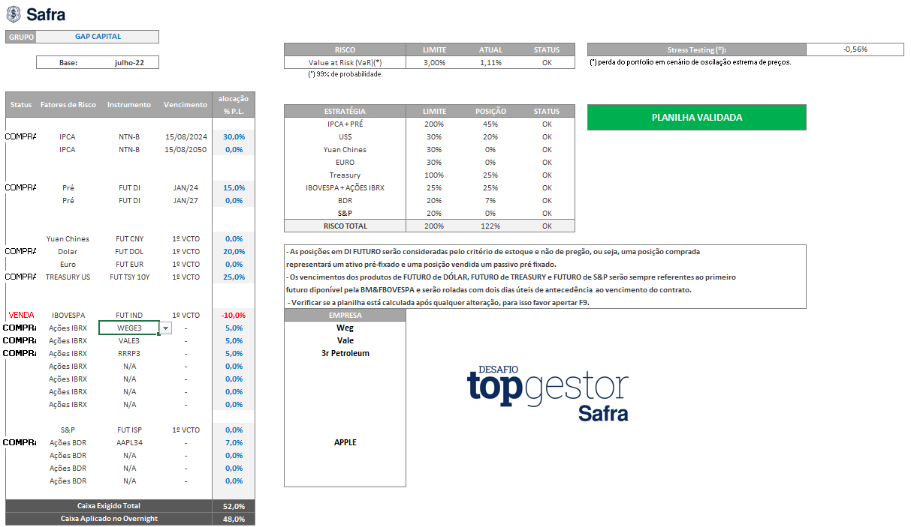

#  Desafio Safra Top Gestor

O objetivo deste desafio foi simular a escolha de ativos e a montagem de uma carteira de investimentos, com foco na análise de cenários macro, microeconômicos, políticos etc. No arquivo **[Excel](safra-top-gestor-portifolio-de-investimentos.xlsx)**, está a carteira validada com os ativos escolhidos, enquanto no [PDF](safra-top-gestor-carta-ao-investidor.pdf)** está a apresentação detalhada da estratégia adotada, incluindo a análise dos cenários considerados ao longo do desafio.

