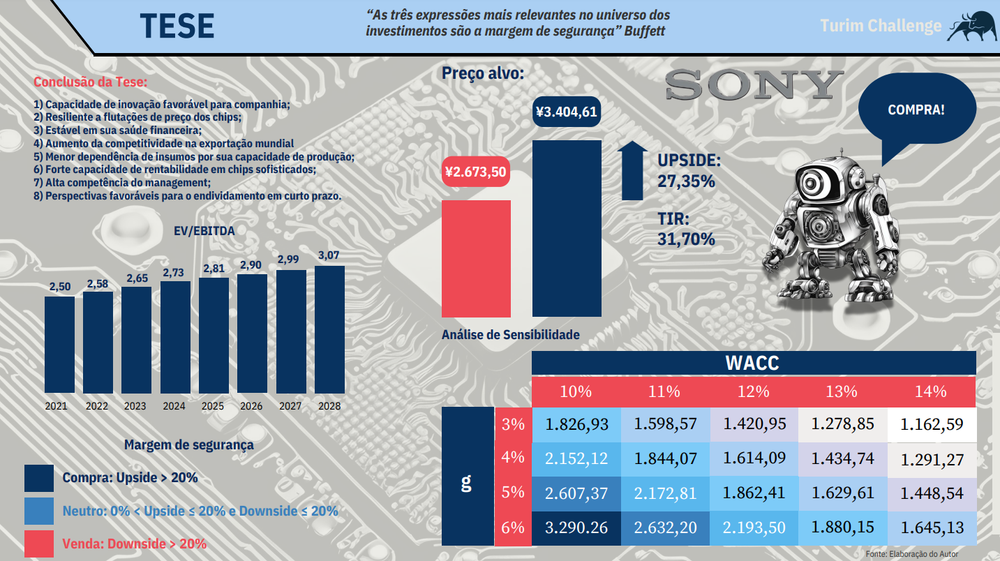

#  Desafio Turim Investimentos

Este desafio consistiu em analisar os impactos da inflação em um setor, com base no contexto econômico global de inflação nos países desenvolvidos. Foi realizada uma análise detalhada do setor de semicondutores, com foco na empresa Sony. A recomendação final, fundamentada em análises qualitativas e quantitativas, está disponível no **[Challenge Turim.pdf](Challenge-Turim.pdf)**, que contém os dados e métricas validadas. No mesmo arqquivo, encontra-se a apresentação abrangendo os impactos setoriais, contexto macroeconômico, e justificativas para a recomendação proposta de Compra da Sony.

