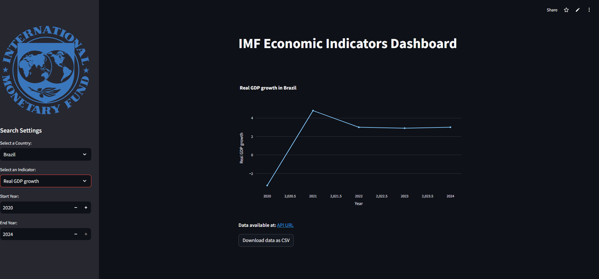

# IMF Data Challenge

App for systematizing macroeconomic and microeconomic time series via the International Monetary Fund (IMF) API.



## Tutorial for Running the Application

1. **Install the Requirements**
   ```bash
   $ pip install -r requirements.txt
2. **Run the Application**
   ```bash
   $ streamlit run app.py
3. **Application Navigation**

   -**Select a Country**: Choose a country from the list to view the economic indicators.
   
   -**Choose an Indicator**: Select an economic indicator from the IMF.
   
   -**Define the Year Range**: Input the start and end years for the analysis.
5. **Features**
   
   -Interactive data visualization with graphs.
   
   -Option to download data in CSV format.
   
   -Links to access the IMF API.


